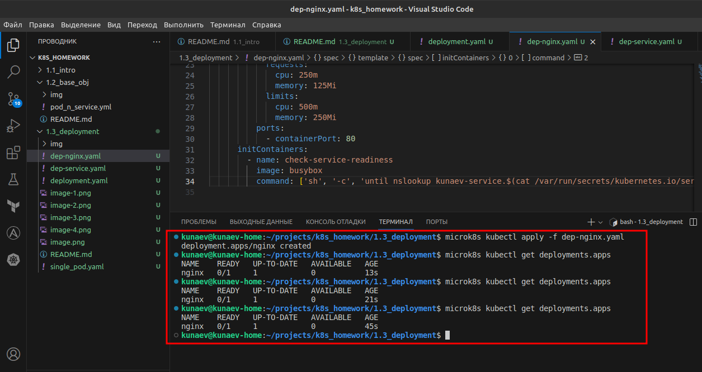

# Домашнее задание к занятию «Запуск приложений в K8S»

### Задание 1. Создать Deployment и обеспечить доступ к репликам приложения из другого Pod

1. Создать Deployment приложения, состоящего из двух контейнеров — nginx и multitool. Решить возникшую ошибку.
    Ошибка заключалась в том, что multitool пытался забиндить 80й порт, который уже использовался контейнером nginx. После переопределения переменной окружения "HTTP_PORT" на порт 8080 в разделе env, проблема была решена. Описание переменной есть репозитории мультитула. 
 
2. После запуска увеличить количество реплик работающего приложения до 2.
3. Продемонстрировать количество подов до и после масштабирования.

4. Создать Service, который обеспечит доступ до реплик приложений из п.1.

5. Создать отдельный Pod с приложением multitool и убедиться с помощью `curl`, что из пода есть доступ до приложений из п.1.

## Manifesto 
[deployment+service](deployment.yaml)
[single_pod](single_pod.yaml)
------

### Задание 2. Создать Deployment и обеспечить старт основного контейнера при выполнении условий

1. Создать Deployment приложения nginx и обеспечить старт контейнера только после того, как будет запущен сервис этого приложения.
2. Убедиться, что nginx не стартует. В качестве Init-контейнера взять busybox.

3. Создать и запустить Service. Убедиться, что Init запустился.

4. Продемонстрировать состояние пода до и после запуска сервиса.

## Manifesto
[nginx](dep-nginx.yaml)
[service](dep-service.yaml)