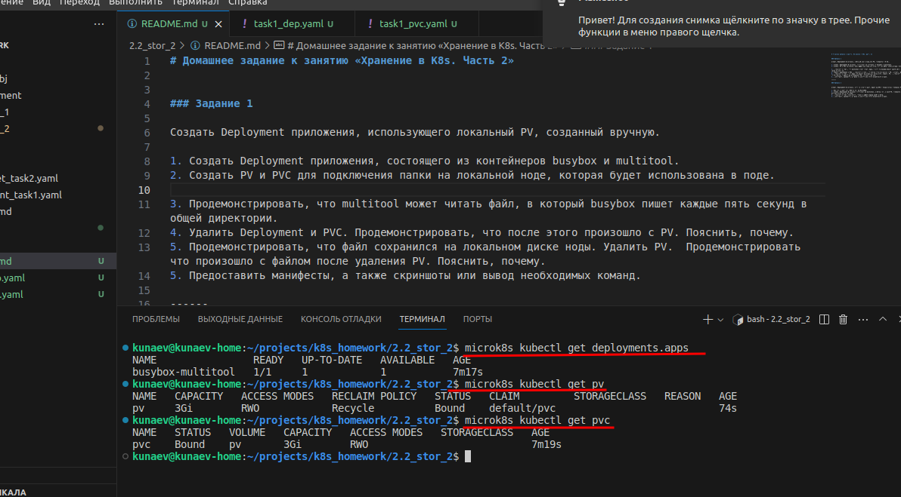
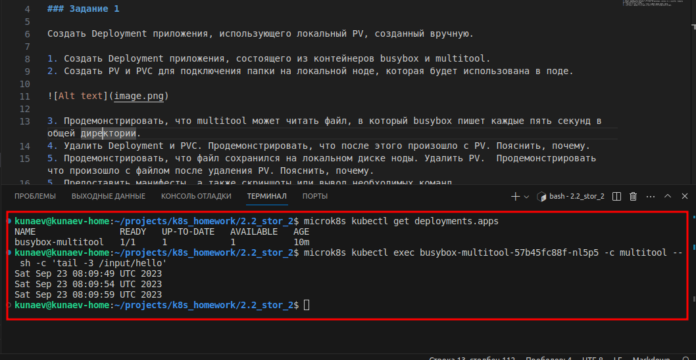
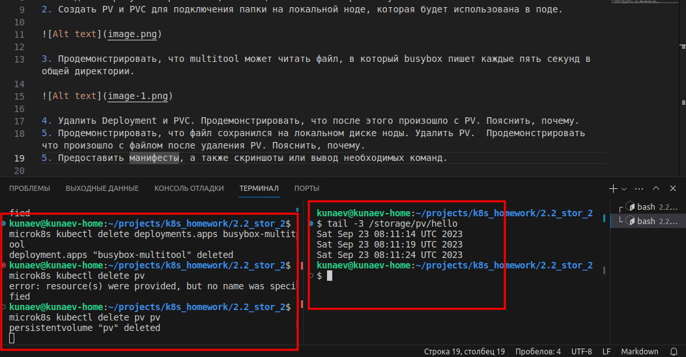
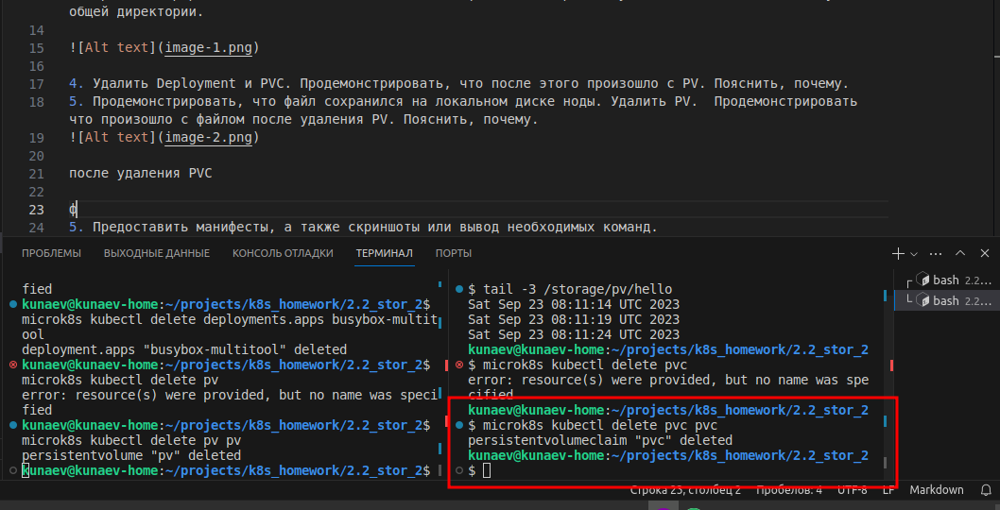

# Домашнее задание к занятию «Хранение в K8s. Часть 2»

### Задание 1

Создать Deployment приложения, использующего локальный PV, созданный вручную.

1. Создать Deployment приложения, состоящего из контейнеров busybox и multitool.
2. Создать PV и PVC для подключения папки на локальной ноде, которая будет использована в поде.

3. Продемонстрировать, что multitool может читать файл, в который busybox пишет каждые пять секунд в общей директории. 

4. Удалить Deployment и PVC. Продемонстрировать, что после этого произошло с PV. Пояснить, почему.
5. Продемонстрировать, что файл сохранился на локальном диске ноды. Удалить PV.  Продемонстрировать что произошло с файлом после удаления PV. Пояснить, почему.

после удаления PVC

###  Пояснение

Deployment и PV не могли быть удалены, а консоль не "освобождалась" тк были заблокированы все еще выполняющейся функцией PVС. Полагаю, что при удалении microk8s должно получить ответы об освобождении ранее зарезервированных ресурсов, но тк VolumeClaim еще выполнялся, то соответствующего ответа не поступало и процессы удаления Deployment и PV не могли завершиться.

5. Предоставить манифесты, а также скриншоты или вывод необходимых команд.

[deployment](task1_dep.yaml)  
[vp-pvc](task1_pvc.yaml)

------

### Задание 2

Создать Deployment приложения, которое может хранить файлы на NFS с динамическим созданием PV.

1. Включить и настроить NFS-сервер на MicroK8S.
2. Создать Deployment приложения состоящего из multitool, и подключить к нему PV, созданный автоматически на сервере NFS.
3. Продемонстрировать возможность чтения и записи файла изнутри пода. 
4. Предоставить манифесты, а также скриншоты или вывод необходимых команд.