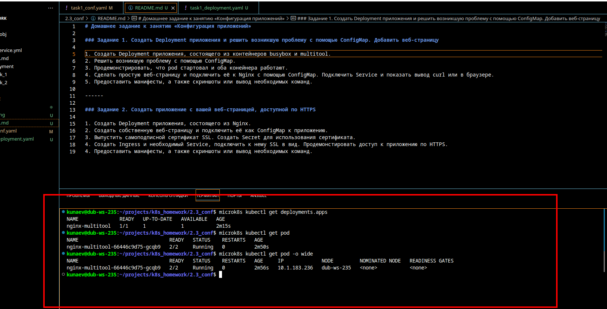
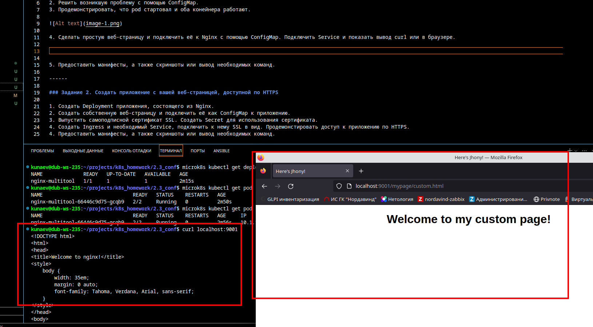
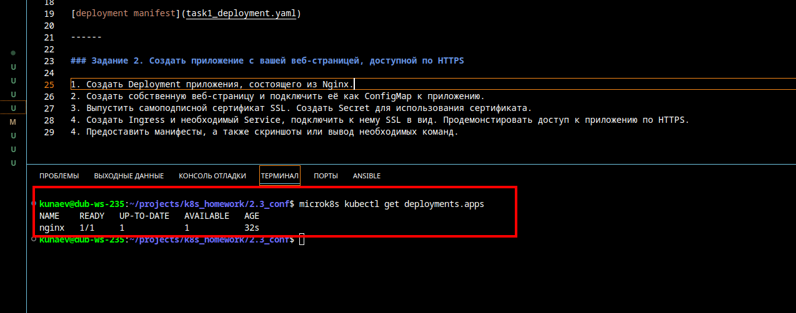
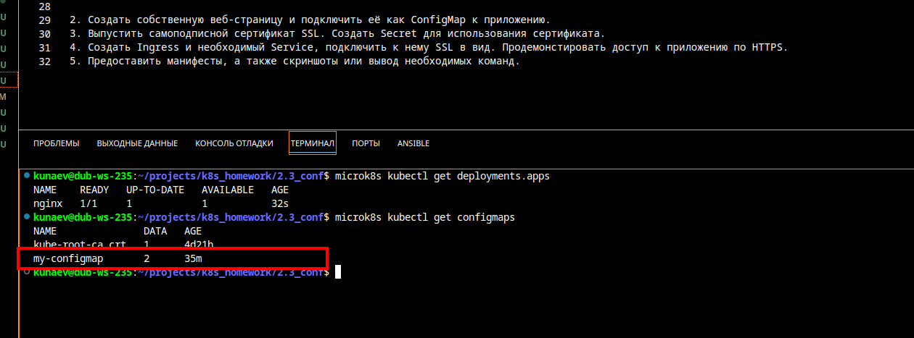
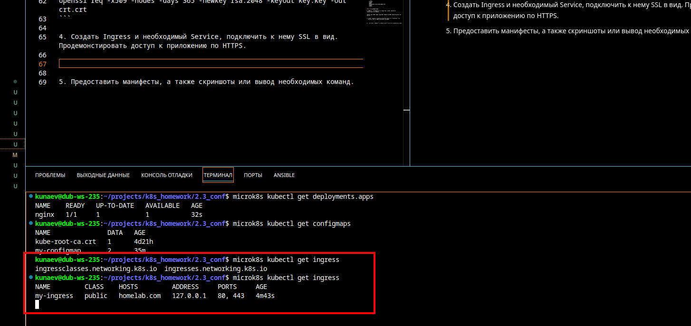
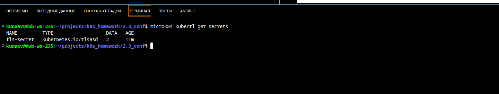
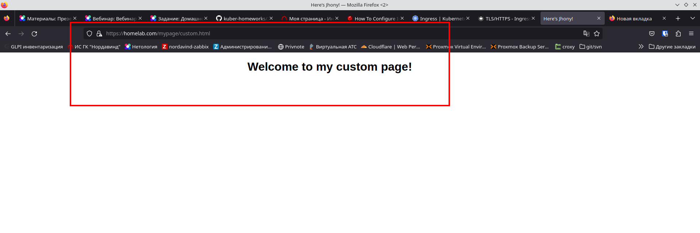
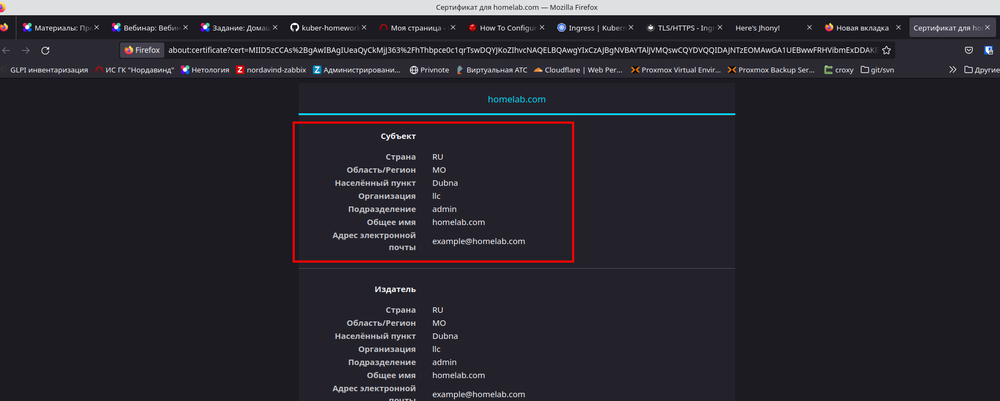

# Домашнее задание к занятию «Конфигурация приложений»

### Задание 1. Создать Deployment приложения и решить возникшую проблему с помощью ConfigMap. Добавить веб-страницу

1. Создать Deployment приложения, состоящего из контейнеров busybox и multitool.
2. Решить возникшую проблему с помощью ConfigMap.
3. Продемонстрировать, что pod стартовал и оба конейнера работают.



4. Сделать простую веб-страницу и подключить её к Nginx с помощью ConfigMap. Подключить Service и показать вывод curl или в браузере.



5. Предоставить манифесты, а также скриншоты или вывод необходимых команд.

[conf manifest](task1_conf.yaml)

[deployment manifest](task1_deployment.yaml)

------

### Задание 2. Создать приложение с вашей веб-страницей, доступной по HTTPS 

1. Создать Deployment приложения, состоящего из Nginx.
   


2. Создать собственную веб-страницу и подключить её как ConfigMap к приложению.

```
apiVersion: v1
kind: ConfigMap
metadata:
  name: my-configmap
  namespace: default
data:
  CUSTOM_WEB_PAGE: |
    <!DOCTYPE html>
    <html>
    <head>
    <title>Here's Jhony!</title>
    <style>
        body {
            width: 35em;
            margin: 0 auto;
            font-family: Tahoma, Verdana, Arial, sans-serif;
        }
    </style>
    </head>
    <body>
    <h1>Welcome to my custom page!</h1>
    </body>
    </html>
```



3. Выпустить самоподписной сертификат SSL. Создать Secret для использования сертификата.

```
openssl req -x509 -nodes -days 365 -newkey rsa:2048 -keyout key.key -out crt.crt
```

4. Создать Ingress и необходимый Service, подключить к нему SSL в вид. Продемонстировать доступ к приложению по HTTPS. 











5. Предоставить манифесты, а также скриншоты или вывод необходимых команд.

[secret/conf manifest](task2_conf.yaml)  
[deploy manifest](task2_deployment.yaml)