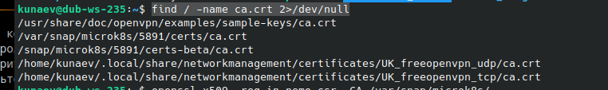
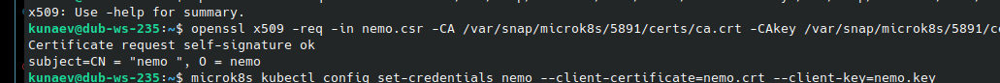
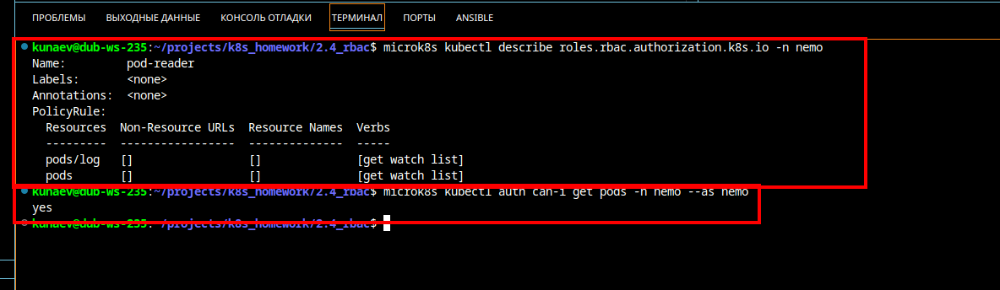

# Домашнее задание к занятию «Управление доступом»

------

### Задание 1. Создайте конфигурацию для подключения пользователя

1. Создайте и подпишите SSL-сертификат для подключения к кластеру.

* Находим где лежат корневые сертификаты microk8s

```
find / -name ca.crt 2>/dev/null
```



* создаем закрытую часть сертификата и запрос на его подпись 

```
kunaev@dub-ws-235:~$ openssl genrsa -out nemo.key 2048
kunaev@dub-ws-235:~$ openssl req -new -key nemo.key -out nemo.csr -subj "/CN=nemo /O=nemo"
```


* подписываем созданный сертификат - корневым 

```
openssl x509 -req -in nemo.csr -CA /var/snap/microk8s/5891/certs/ca.crt -CAkey /var/snap/microk8s/5891/certs/ca.key -CAcreateserial -out nemo.crt -days 500

```




2. Настройте конфигурационный файл kubectl для подключения.

* Добавляем креды в конфиг kubectl

```
microk8s kubectl config set-credentials nemo --client-certificate=nemo.crt --client-key=nemo.key
```

* проверяем результат

```
kunaev@dub-ws-235:~$ microk8s kubectl config view
apiVersion: v1
clusters:
- cluster:
    certificate-authority-data: DATA+OMITTED
    server: https://127.0.0.1:16443
  name: microk8s-cluster
contexts:
- context:
    cluster: microk8s-cluster
    user: admin
  name: microk8s
current-context: microk8s
kind: Config
preferences: {}
users:
- name: admin
  user:
    token: REDACTED
- name: nemo
  user:
    client-certificate: /home/kunaev/nemo.crt
    client-key: /home/kunaev/nemo.key

```


3. Создайте роли и все необходимые настройки для пользователя.

* Создаем Роль и привязываем ее к пользователю

```
---
kind: Role
apiVersion: rbac.authorization.k8s.io/v1
metadata:
  namespace: default
  name: pod-reader
rules:
- apiGroups: [“”]
  resources: [“pods”]
  verbs: [“get”, “watch”, “list”]

---
kind: RoleBinding
apiVersion: rbac.authorization.k8s.io/v1
metadata:
  name: read-pods
  namespace: default
subjects:
- kind: User
  name: nemo
  apiGroup: rbac.authorization.k8s.io
roleRef:
  kind: Role
  name: pod-reader
  apiGroup: rbac.authorization.k8s.io
```

4. Предусмотрите права пользователя. Пользователь может просматривать логи подов и их конфигурацию (`kubectl logs pod <pod_id>`, `kubectl describe pod <pod_id>`).
   


5. Предоставьте манифесты и скриншоты и/или вывод необходимых команд.

[task1_role_and_bind.yaml](task1_role_and_bind.yaml)
