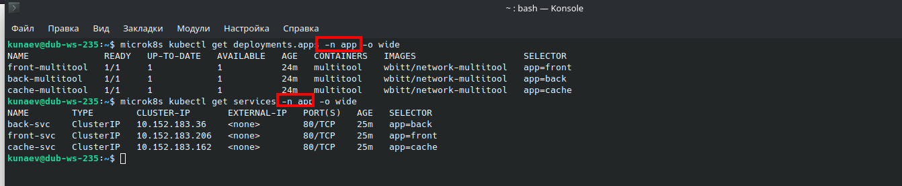
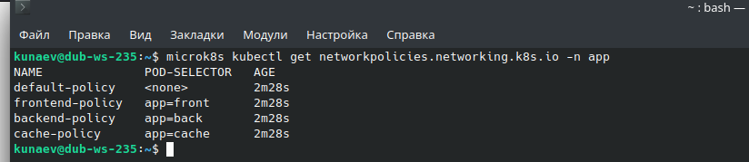
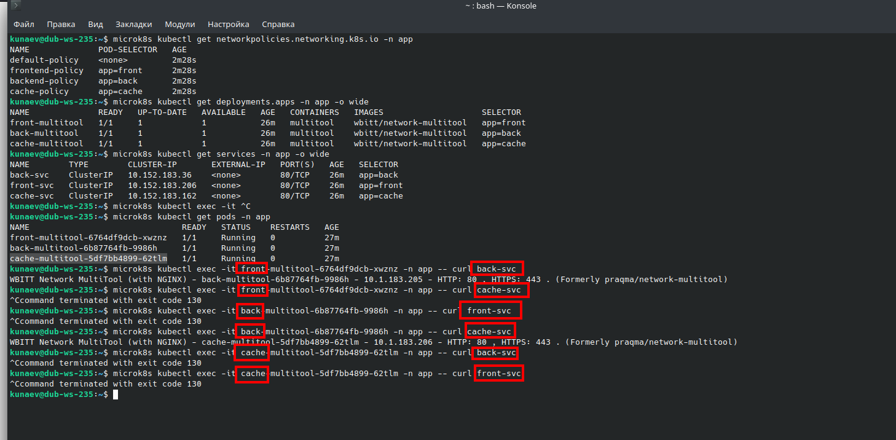

# Домашнее задание к занятию «Как работает сеть в K8s»

### Задание 1. Создать сетевую политику или несколько политик для обеспечения доступа

1. Создать deployment'ы приложений frontend, backend и cache и соответсвующие сервисы.
2. В качестве образа использовать network-multitool.
3. Разместить поды в namespace App.
   

4. Создать политики, чтобы обеспечить доступ frontend -> backend -> cache. Другие виды подключений должны быть запрещены.

5. Продемонстрировать, что трафик разрешён и запрещён.

Manifests:
[backend](back.yaml)  
[frontend](front.yaml)  
[cache](cache.yaml)  
[net-policies](net-policy.yaml)  