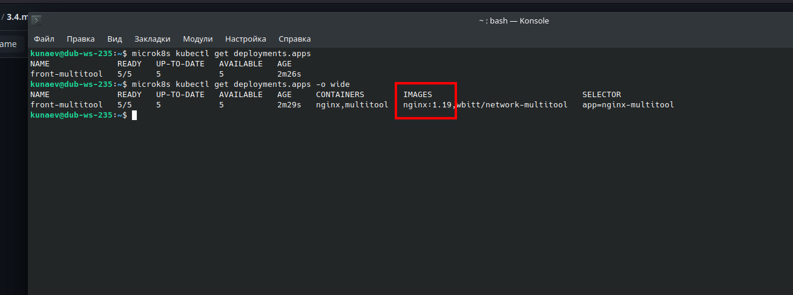
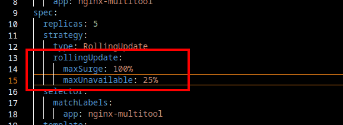
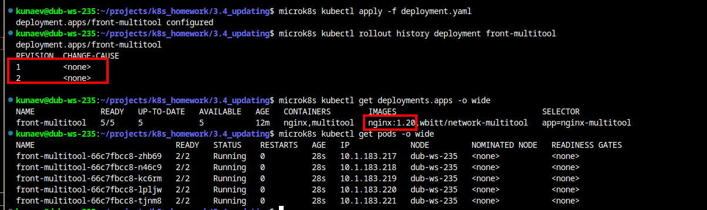
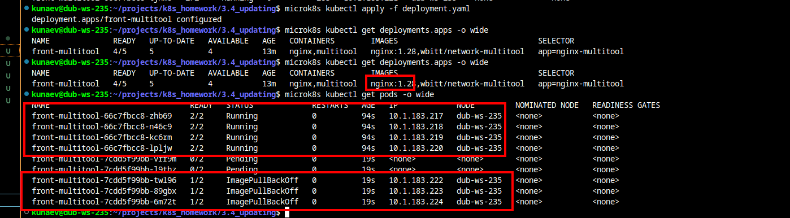
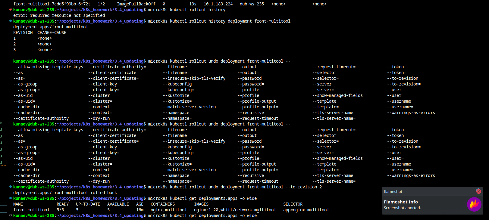

# Домашнее задание к занятию «Обновление приложений»

### Задание 1. Выбрать стратегию обновления приложения и описать ваш выбор

1. Имеется приложение, состоящее из нескольких реплик, которое требуется обновить.
2. Ресурсы, выделенные для приложения, ограничены, и нет возможности их увеличить.
3. Запас по ресурсам в менее загруженный момент времени составляет 20%.
4. Обновление мажорное, новые версии приложения не умеют работать со старыми.
5. Вам нужно объяснить свой выбор стратегии обновления приложения.

Я сдела бы выпол в пользу стратегии Recreate, поскольку:
* обновление мажорное, т.е. новые версии все равно не смогут работать со старыми, что делает RollingUpdate бесполезным
* макс запас ресурсов во время мин нагрузки - 20%, что не позволит выбрать A/B или Canary режимы

### Задание 2. Обновить приложение

1. Создать deployment приложения с контейнерами nginx и multitool. Версию nginx взять 1.19. Количество реплик — 5.
   


2. Обновить версию nginx в приложении до версии 1.20, сократив время обновления до минимума. Приложение должно быть доступно.
   
Изменил политику обновления на максимально производительную, подняв лимиты на контейнеры.  
  

После чего накатил обновления  



3. Попытаться обновить nginx до версии 1.28, приложение должно оставаться доступным.

Как видно старые поды работают, а новые не могуть создаться, тк нет нужного образа




4. Откатиться после неудачного обновления.

Узнаем текую ревизию  
```
 microk8s kubectl rollout history deployment front-multitool
```

Откатываемся к предыдущей

```
microk8s kubectl rollout undo deployment front-multitool --to-revision 2

deployment.apps/front-multitool rolled back
```

Проверяем

```
microk8s kubectl get deployments.apps -o wide

NAME              READY   UP-TO-DATE   AVAILABLE   AGE   CONTAINERS        IMAGES                               SELECTOR
front-multitool   5/5     5            5           16m   nginx,multitool   nginx:1.20,wbitt/network-multitool   app=nginx-multitool
```



[manifest](deployment.yaml)