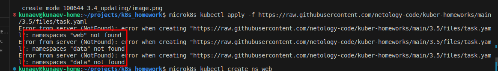
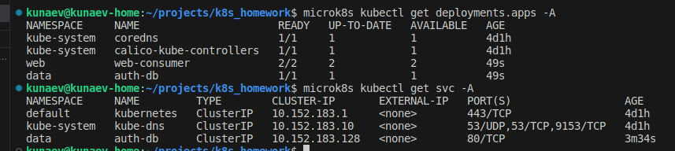
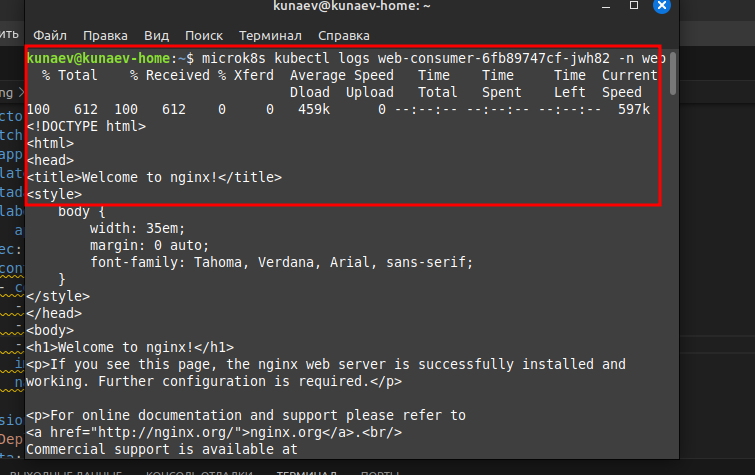

# Домашнее задание к занятию Troubleshooting

1. Установить приложение по команде:
```shell
kubectl apply -f https://raw.githubusercontent.com/netology-code/kuber-homeworks/main/3.5/files/task.yaml
```
2. Выявить проблему и описать.

Проблема в отсутствии необходимых пространствах имен



Также, если можно это назвать проблемой, из ns web curl не мог разрезолвить сервис auth-db. Поскльку обращение идет из другого пространства имен, нужно было изменить имя с *db-auth* на *auth-db.data.svc.cluster.local*


3. Исправить проблему, описать, что сделано.

```
microk8s kubectl create ns web  
microk8s kubectl create ns data  
```

4. Продемонстрировать, что проблема решена.

статуc подов



curl запрос к сервису

