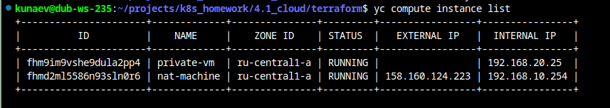

# Домашнее задание к занятию «Организация сети

### Задание 1. Yandex Cloud 


1. Создать пустую VPC. Выбрать зону.

```HCL
resource "yandex_vpc_network" "my-network" {
  name = var.vpc_name
}

```

2. Публичная подсеть.
 - Создать в VPC subnet с названием public, сетью 192.168.10.0/24.
  
```HCL
resource "yandex_vpc_subnet" "public" {
  name           = "public"
  zone           = var.default_zone
  network_id     = yandex_vpc_network.my-network.id
  v4_cidr_blocks = ["192.168.10.0/24"]
}
  
```
 - Создать в этой подсети NAT-инстанс, присвоив ему адрес 192.168.10.254. В качестве image_id использовать fd80mrhj8fl2oe87o4e1.



 - Создать в этой публичной подсети виртуалку с публичным IP, подключиться к ней и убедиться, что есть доступ к интернету.

 


3. Приватная подсеть.
 - Создать в VPC subnet с названием private, сетью 192.168.20.0/24.

```HCL

resource "yandex_vpc_subnet" "private" {
  name           = "private"
  zone           = var.default_zone
  network_id     = yandex_vpc_network.my-network.id
  v4_cidr_blocks = ["192.168.20.0/24"]
  route_table_id = yandex_vpc_route_table.nat-instance-route.id
}

```

 - Создать route table. Добавить статический маршрут, направляющий весь исходящий трафик private сети в NAT-инстанс.

```HCL
resource "yandex_vpc_route_table" "nat-instance-route" {
  name       = "nat-instance-route"
  network_id = yandex_vpc_network.my-network.id
  static_route {
    destination_prefix = "0.0.0.0/0"
    next_hop_address   = yandex_compute_instance.nat-instance.network_interface.0.ip_address
  }
}
```

 - Создать в этой приватной подсети виртуалку с внутренним IP, подключиться к ней через виртуалку, созданную ранее, и убедиться, что есть доступ к интернету.
  
 

 [Terraform-ное художество](terraform)