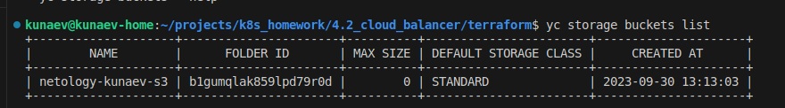
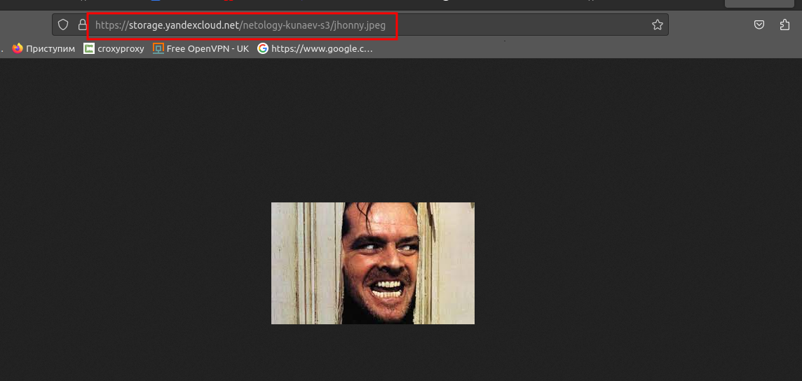
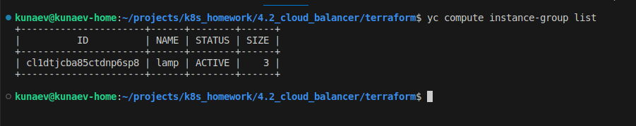
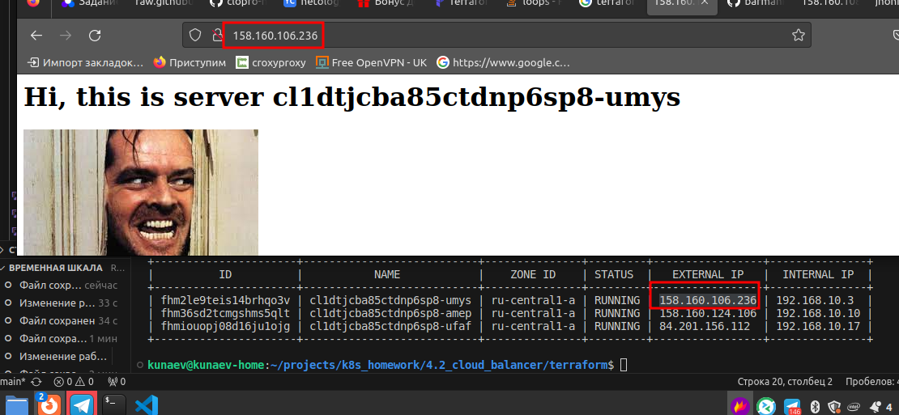
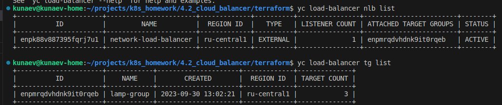
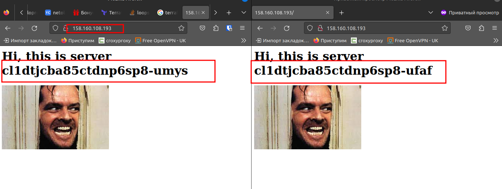
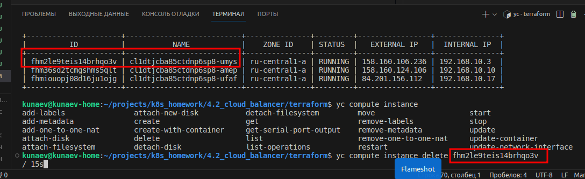
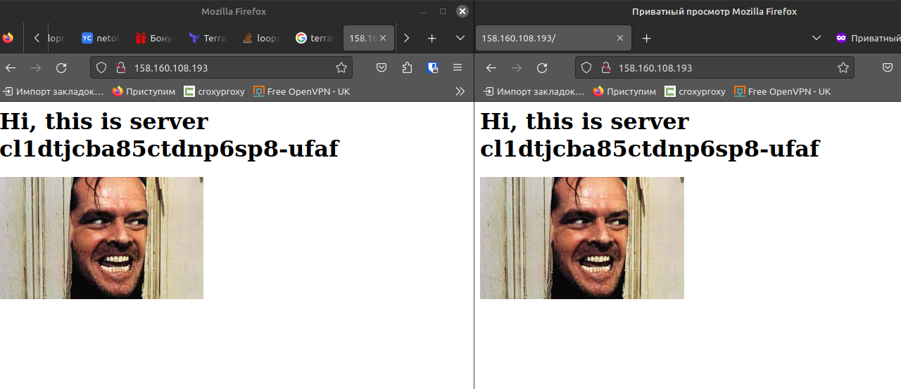

# Домашнее задание к занятию «Вычислительные мощности. Балансировщики нагрузки»  

## Задание 1. Yandex Cloud 


1. Создать бакет Object Storage и разместить в нём файл с картинкой:

 - Создать бакет в Object Storage с произвольным именем (например, _имя_студента_дата_).  
 
 - Положить в бакет файл с картинкой.  
 - Сделать файл доступным из интернета.  
 
 
2. Создать группу ВМ в public подсети фиксированного размера с шаблоном LAMP и веб-страницей, содержащей ссылку на картинку из бакета:

 - Создать Instance Group с тремя ВМ и шаблоном LAMP. Для LAMP рекомендуется использовать `image_id = fd827b91d99psvq5fjit`.
 - Для создания стартовой веб-страницы рекомендуется использовать раздел `user_data` в [meta_data](https://cloud.yandex.ru/docs/compute/concepts/vm-metadata).  
 
 - Разместить в стартовой веб-странице шаблонной ВМ ссылку на картинку из бакета.   

 - Настроить проверку состояния ВМ.
 
```HCL
  deploy_policy {
    max_unavailable = 2
    max_creating    = 3
    max_expansion   = 2
    max_deleting    = 3
  }
```

3. Подключить группу к сетевому балансировщику:

- Создать сетевой балансировщик.  
  
```
kunaev@kunaev-home:~/projects/k8s_homework/4.2_cloud_balancer/terraform$ yc load-balancer nlb get enpk88v887395fqrj7u1
id: enpk88v887395fqrj7u1
folder_id: b1gumqlak859lpd79r0d
created_at: "2023-09-30T13:05:18Z"
name: network-load-balancer
region_id: ru-central1
status: ACTIVE
type: EXTERNAL
listeners:
  - name: listener
    address: 158.160.108.193
    port: "80"
    protocol: TCP
    target_port: "80"
    ip_version: IPV4
attached_target_groups:
  - target_group_id: enpmrqdvhdnk9it0rqeb
    health_checks:
      - name: http
        interval: 2s
        timeout: 1s
        unhealthy_threshold: "2"
        healthy_threshold: "2"
        http_options:
          port: "80"
          path: /

```
- Проверить работоспособность, удалив одну или несколько ВМ. 

проверяем, что балансируется
   

удаляем инстанс

  

и еще раз проверяем

`

[tf_файлы](terraform)