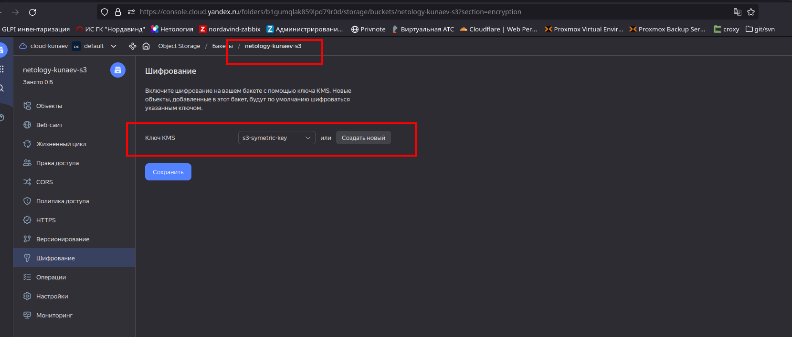
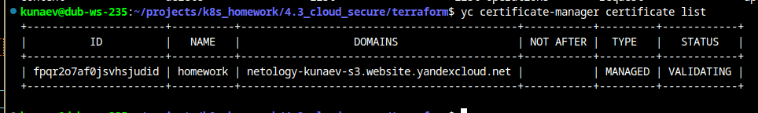
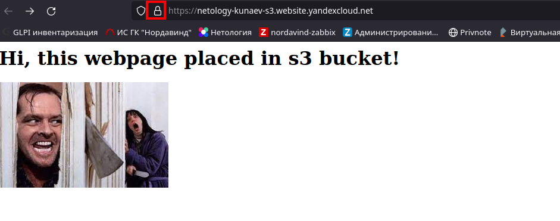

# Домашнее задание к занятию «Безопасность в облачных провайдерах»  

1. С помощью ключа в KMS необходимо зашифровать содержимое бакета:

 - создать ключ в KMS;
  
```HCL
# Создаем симметричный ключ шифрования 
resource "yandex_kms_symmetric_key" "s3-key" {
  name              = "s3-symetric-key"
  description       = "homework key"
  default_algorithm = "AES_128"
  rotation_period   = "8760h" // equal to 1 year
}

```

 - с помощью ключа зашифровать содержимое бакета, созданного ранее.

```HCL
#Колдуем S3
resource "yandex_storage_bucket" "test" {
  access_key = yandex_iam_service_account_static_access_key.sa-static-key.access_key
  secret_key = yandex_iam_service_account_static_access_key.sa-static-key.secret_key
  bucket = "netology-kunaev-s3"
  depends_on = [ yandex_iam_service_account_static_access_key.sa-static-key, yandex_kms_symmetric_key.s3-key ]

   server_side_encryption_configuration {
    rule {
      apply_server_side_encryption_by_default {
        kms_master_key_id = yandex_kms_symmetric_key.s3-key.id
        sse_algorithm     = "aws:kms"
      }
    }
  }

  anonymous_access_flags {
    read = true
    list = false
    config_read = true
  }
  
}
```



2. (Выполняется не в Terraform)* Создать статический сайт в Object Storage c собственным публичным адресом и сделать доступным по HTTPS:

 - создать сертификат;
  


 - создать статическую страницу в Object Storage и применить сертификат HTTPS;
 - в качестве результата предоставить скриншот на страницу с сертификатом в заголовке (замочек).

