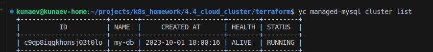
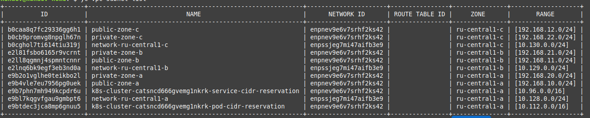
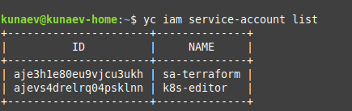
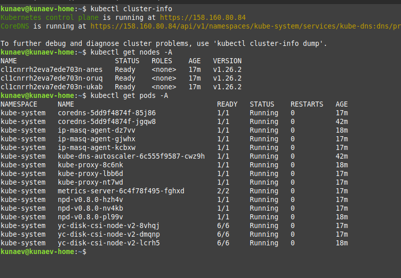

# Домашнее задание к занятию «Кластеры. Ресурсы под управлением облачных провайдеров»


## Задание 1. Yandex Cloud

1. Настроить с помощью Terraform кластер баз данных MySQL.

 - Используя настройки VPC из предыдущих домашних заданий, добавить дополнительно подсеть private в разных зонах, чтобы обеспечить отказоустойчивость. 
  
```HCL

resource "yandex_vpc_network" "my-network" {
  name = var.vpc_name
}

######################
# SUBNET DESCRIPTION #
######################

resource "yandex_vpc_subnet" "private-zone-a" {
  name           = "private"
  zone           = "ru-central1-a"
  network_id     = yandex_vpc_network.my-network.id
  v4_cidr_blocks = ["192.168.20.0/24"]
}

resource "yandex_vpc_subnet" "private-zone-b" {
  name           = "private"
  zone           = "ru-central1-b"
  network_id     = yandex_vpc_network.my-network.id
  v4_cidr_blocks = ["192.168.21.0/24"]
}

resource "yandex_vpc_subnet" "private-zone-c" {
  name           = "private"
  zone           = "ru-central1-c"
  network_id     = yandex_vpc_network.my-network.id
  v4_cidr_blocks = ["192.168.22.0/24"]
}

```

 - Разместить ноды кластера MySQL в разных подсетях.

```HCL
resource "yandex_mdb_mysql_cluster" "mysql-cluster" {
...
  host {
    zone      = "ru-central1-a"
    subnet_id = yandex_vpc_subnet.private-zone-a.id
    assign_public_ip = false
  }

  host {
    zone      = "ru-central1-b"
    subnet_id = yandex_vpc_subnet.private-zone-b.id
    assign_public_ip = false
  }

    host {
    zone      = "ru-central1-c"
    subnet_id = yandex_vpc_subnet.private-zone-c.id
    assign_public_ip = false
  }
...
}


```
 - Необходимо предусмотреть репликацию с произвольным временем технического обслуживания.
```HCL
resource "yandex_mdb_mysql_cluster" "mysql-cluster" {
...

  maintenance_window {
    type = "ANYTIME"
  }
...

}

```

 - Использовать окружение Prestable, платформу Intel Broadwell с производительностью 50% CPU и размером диска 20 Гб.

```HCL
resource "yandex_mdb_mysql_cluster" "mysql-cluster" {
...

  environment = "PRESTABLE"
  resources {
    resource_preset_id = "b1.medium"
    disk_type_id       = "network-ssd"
    disk_size          = 20
}
...
}

```


 - Задать время начала резервного копирования — 23:59.

```HCL
  backup_window_start {
    hours = 23
    minutes = 59
  }

```

 - Включить защиту кластера от непреднамеренного удаления.

```HCL
  deletion_protection = true
```

 - Создать БД с именем `netology_db`, логином и паролем.

```HCL
resource "yandex_mdb_mysql_database" "netology_db" {
  cluster_id = yandex_mdb_mysql_cluster.mysql-cluster.id
  name       = "netology_db"
}

resource "yandex_mdb_mysql_user" "db-user" {
  cluster_id = yandex_mdb_mysql_cluster.mysql-cluster.id
  name       = "awesome-user"
  password   = "awesome-password"
  permission {
    database_name = "netology_db"
    roles         = ["ALL"]
  }
}
```



2. Настроить с помощью Terraform кластер Kubernetes.

 - Используя настройки VPC из предыдущих домашних заданий, добавить дополнительно две подсети public в разных зонах, чтобы обеспечить отказоустойчивость.



 - Создать отдельный сервис-аккаунт с необходимыми правами. 
 


 - Создать региональный мастер Kubernetes с размещением нод в трёх разных подсетях.
```HCL
resource "yandex_kubernetes_cluster" "k8s-regional" {
...
    regional {
      region = "ru-central1"
      location {
        zone      = yandex_vpc_subnet.public-zone-a.zone
        subnet_id = yandex_vpc_subnet.public-zone-a.id
      }
      location {
        zone      = yandex_vpc_subnet.public-zone-b.zone
        subnet_id = yandex_vpc_subnet.public-zone-b.id
      }
      location {
        zone      = yandex_vpc_subnet.public-zone-c.zone
        subnet_id = yandex_vpc_subnet.public-zone-c.id
      }
    }
...
}

```

 - Добавить возможность шифрования ключом из KMS, созданным в предыдущем домашнем задании.
```HCL
resource "yandex_kubernetes_cluster" "k8s-regional" {
...
  kms_provider {
    key_id = yandex_kms_symmetric_key.s3-key.id
  }
...
}

```

 - Создать группу узлов, состояющую из трёх машин с автомасштабированием до шести.
 ```HCL
 resource "yandex_kubernetes_node_group" "worker-instances" {
...

  scale_policy {
    auto_scale {
      initial = 3
      max     = 6
      min     = 3
    }
  }
...
 }
 
 ```
 - Подключиться к кластеру с помощью `kubectl`.

](image-4.png)

[terraform src](terraform)